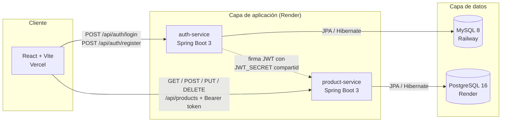
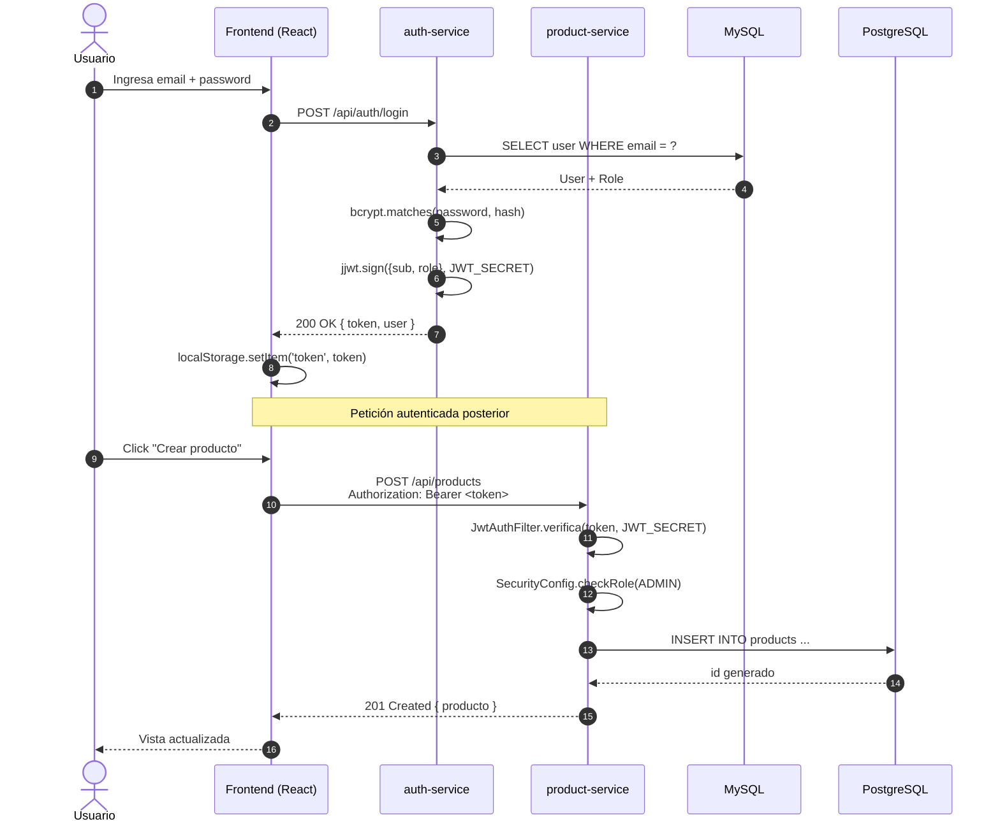
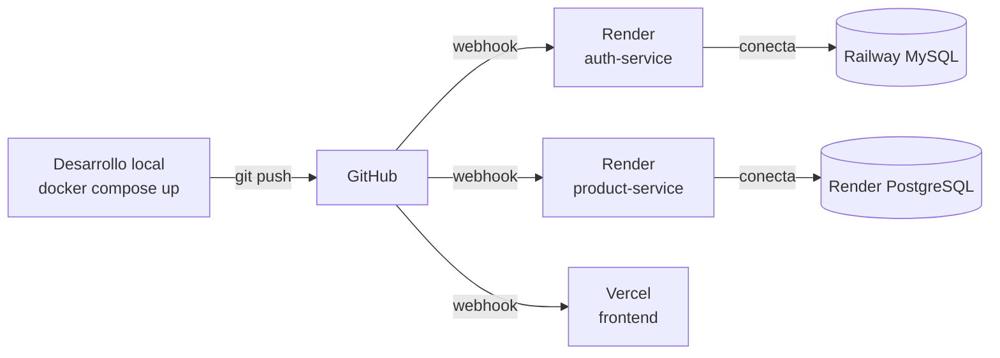
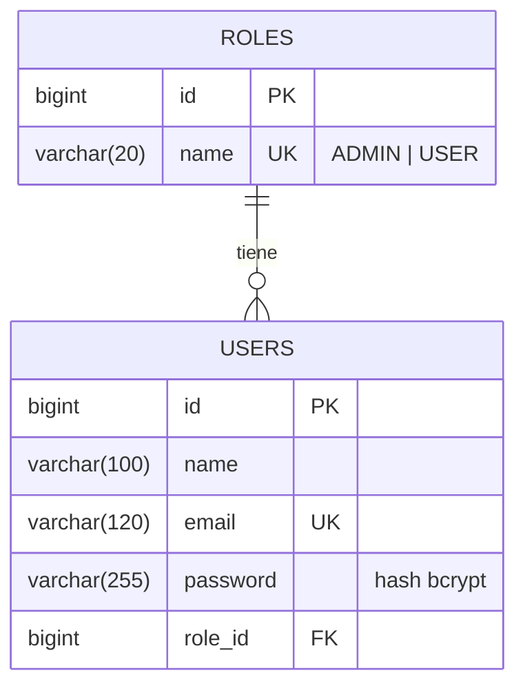
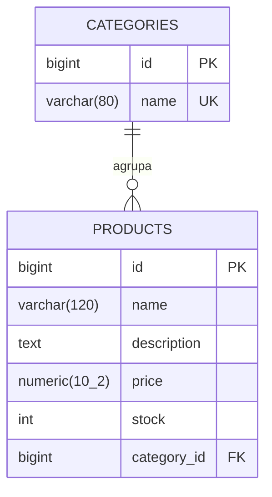
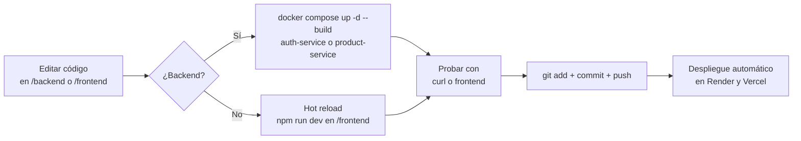

<div align="center">

# Óptica — Sistema de Gestión de Productos

Aplicación full-stack basada en microservicios para administrar el catálogo de una óptica, con autenticación JWT, control de roles y dos bases de datos relacionales independientes.

[](https://openjdk.org/)
[](https://spring.io/projects/spring-boot)
[](https://react.dev/)
[](https://www.mysql.com/)
[](https://www.postgresql.org/)
[](https://docs.docker.com/compose/)
[](https://jwt.io/)

</div>

---

## Tabla de contenido

1. [Descripción del proyecto](#descripción-del-proyecto)
2. [Arquitectura](#arquitectura)
3. [Stack tecnológico](#stack-tecnológico)
4. [Estructura del repositorio](#estructura-del-repositorio)
5. [Flujo de trabajo del sistema](#flujo-de-trabajo-del-sistema)
6. [Modelo de datos](#modelo-de-datos)
7. [Endpoints de la API](#endpoints-de-la-api)
8. [Puesta en marcha](#puesta-en-marcha)
9. [Workflow de desarrollo](#workflow-de-desarrollo)
10. [Despliegue en la nube](#despliegue-en-la-nube)
11. [Variables de entorno](#variables-de-entorno)
12. [Sustentación del proyecto](#sustentación-del-proyecto)

---

## Descripción del proyecto

El sistema permite a una óptica gestionar su catálogo de productos (lentes formulados, gafas de sol, monturas y lentes de contacto) con dos perfiles de uso bien diferenciados:

| Rol | Permisos |
|-----|----------|
| **ADMIN** | Crear, editar, eliminar y consultar productos y categorías |
| **USER** | Consultar productos disponibles y filtrarlos por categoría |

El backend está dividido en **dos microservicios independientes** que se comunican únicamente a través del token JWT (no se llaman entre sí), lo que permite escalarlos, desplegarlos y mantenerlos por separado.

---

## Arquitectura



### Decisiones de diseño

- **Microservicios independientes:** cada servicio tiene su propio `Dockerfile`, su propia BD y su propio ciclo de despliegue. Si cae uno, el otro sigue funcionando.
- **JWT como contrato de seguridad:** el `JWT_SECRET` compartido es el único acoplamiento entre servicios. Esto se llama **autenticación stateless descentralizada**.
- **Bases de datos heterogéneas:** se usa MySQL para identidad (modelo simple, transacciones cortas) y PostgreSQL para productos (mejor manejo de tipos numéricos, texto largo y queries más expresivas).
- **Arquitectura en capas dentro de cada servicio:** Controller → Service → Repository → Model/DTO. Patrón estándar en Spring Boot que separa responsabilidades.

---

## Stack tecnológico

| Capa | Tecnología | Por qué |
|------|------------|---------|
| **Lenguaje backend** | Java 17 (LTS) | Soporte a largo plazo, compatible con todos los runtimes cloud |
| **Framework backend** | Spring Boot 3.3.4 | Estándar de industria, autoconfiguración, ecosistema maduro |
| **ORM** | Spring Data JPA + Hibernate | Mapeo objeto-relacional sin escribir SQL repetitivo |
| **Seguridad** | Spring Security 6 + jjwt 0.12 | Filtros en cadena, soporte declarativo de roles |
| **Build** | Maven 3.9 | Compatible con todos los IDE y servicios CI/CD |
| **Base de datos 1** | MySQL 8.0 | Identidad y autenticación |
| **Base de datos 2** | PostgreSQL 16 | Catálogo de productos |
| **Frontend** | React 18 + Vite + React Router + Axios | Build rápido, hot reload, SPA con rutas protegidas |
| **Servidor estático** | Nginx Alpine | Sirve el bundle de React en producción |
| **Contenedores** | Docker + Docker Compose | Orquestación local y empaquetado para la nube |

---

## Estructura del repositorio

```
Optica/
├── backend/
│   ├── auth-service/                    # Microservicio 1 — autenticación (MySQL)
│   │   ├── src/main/java/com/optica/auth/
│   │   │   ├── controller/              # Capa REST (HTTP in/out)
│   │   │   ├── service/                 # Capa de lógica de negocio
│   │   │   ├── repository/              # Capa de acceso a datos (JpaRepository)
│   │   │   ├── model/                   # Entidades JPA (@Entity)
│   │   │   ├── dto/                     # Request/Response con validaciones
│   │   │   ├── security/                # JwtUtil, JwtAuthFilter, SecurityConfig
│   │   │   ├── config/                  # DataInitializer (carga de roles ADMIN/USER)
│   │   │   ├── exception/               # ApiException + GlobalExceptionHandler
│   │   │   └── AuthServiceApplication.java
│   │   ├── src/main/resources/application.yml
│   │   ├── pom.xml
│   │   └── Dockerfile
│   │
│   └── product-service/                 # Microservicio 2 — productos (PostgreSQL)
│       └── ... (misma estructura por capas)
│
├── frontend/                            # Cliente React + Vite
│   ├── src/
│   │   ├── api/                         # Clientes Axios (auth, products) con interceptor JWT
│   │   ├── components/                  # Navbar, ProtectedRoute
│   │   ├── context/                     # AuthContext (estado global del usuario)
│   │   ├── pages/                       # Login, Register, Catalog, AdminProducts, ProductForm
│   │   └── App.jsx
│   ├── Dockerfile                       # Multi-stage: build con Node, sirve con Nginx
│   ├── nginx.conf
│   └── vite.config.js
│
├── docker-compose.yml                   # Orquesta los 5 contenedores
├── .gitignore
└── README.md
```

---

## Flujo de trabajo del sistema

### 1. Flujo de autenticación (login + acceso a recurso protegido)



### 2. Flujo de una petición a través de las capas (request lifecycle)

```mermaid
flowchart TB
    A[HTTP Request<br/>POST /api/products] --> B[JwtAuthFilter<br/>verifica token]
    B --> C[SecurityFilterChain<br/>verifica rol ADMIN]
    C --> D[ProductController<br/>@Valid en DTO]
    D --> E[ProductService<br/>lógica de negocio]
    E --> F[ProductRepository<br/>JpaRepository.save]
    F --> G[Hibernate genera SQL]
    G --> H[(PostgreSQL)]
    H --> G
    G --> F
    F --> E
    E --> I[ProductResponse DTO]
    I --> D
    D --> J[HTTP 201 + JSON]
```

### 3. Flujo de despliegue (CI/CD manual)



Cada `git push` a la rama `main` dispara automáticamente:
- **Render** reconstruye los dos contenedores Docker del backend.
- **Vercel** rebuilds el frontend con las variables de entorno actualizadas.
- Las bases de datos persisten entre despliegues.

---

## Modelo de datos

### Esquema de `auth-service` (MySQL — `optica_auth`)



### Esquema de `product-service` (PostgreSQL — `optica_products`)



> Cada microservicio tiene un **máximo de 2 entidades principales**, cumpliendo el requisito de tamaño del proyecto.

---

## Endpoints de la API

### `auth-service` — `http://localhost:4001`

| Método | Ruta | Auth | Body / Query | Descripción |
|--------|------|------|--------------|-------------|
| `POST` | `/api/auth/register` | público | `{ name, email, password, role? }` | Crea un usuario. Si no se envía `role`, asigna `USER`. |
| `POST` | `/api/auth/login` | público | `{ email, password }` | Devuelve `{ token, user }`. Token expira en 2 h. |
| `GET`  | `/api/auth/me` | JWT | — | Devuelve el usuario autenticado. |
| `GET`  | `/api/auth/validate` | JWT | — | Confirma que el token es válido. |
| `GET`  | `/health` | público | — | Health check. |

### `product-service` — `http://localhost:4002`

| Método | Ruta | Auth | Descripción |
|--------|------|------|-------------|
| `GET`    | `/api/categories` | JWT | Lista categorías. |
| `POST`   | `/api/categories` | JWT + ADMIN | Crea categoría. |
| `GET`    | `/api/products` | JWT | Lista productos. Soporta `?category_id=N`. |
| `GET`    | `/api/products/{id}` | JWT | Detalle de producto. |
| `POST`   | `/api/products` | JWT + ADMIN | Crea producto. |
| `PUT`    | `/api/products/{id}` | JWT + ADMIN | Actualiza producto. |
| `DELETE` | `/api/products/{id}` | JWT + ADMIN | Elimina producto. |
| `GET`    | `/health` | público | Health check. |

### Ejemplo de payload

```json
POST /api/products
Authorization: Bearer eyJhbGci...
Content-Type: application/json

{
  "name": "Ray-Ban Aviator Classic",
  "description": "Gafas de sol con cristales polarizados",
  "price": 299.99,
  "stock": 15,
  "categoryId": 2
}
```

---

## Puesta en marcha

### Requisitos

| Herramienta | Versión mínima | Por qué |
|-------------|----------------|---------|
| Docker Desktop | 20+ | Levanta todo el stack con un comando |
| Git | 2.30+ | Clonar el repositorio |

> Para desarrollo local sin Docker se necesita además Java 17, Maven 3.9, MySQL 8 y PostgreSQL 16.

### Levantar el proyecto completo (Docker)

```bash
git clone https://github.com/Mariana44-max/Optica.git
cd Optica
docker compose up -d --build
```

Tras 1-2 minutos (compilación inicial de Spring Boot) la aplicación queda disponible en:

| Servicio | URL local |
|----------|-----------|
| Frontend | http://localhost:5173 |
| Auth API | http://localhost:4001 |
| Products API | http://localhost:4002 |
| MySQL | `localhost:3306` (`root` / `root`) |
| PostgreSQL | `localhost:5432` (`postgres` / `postgres`) |

### Comandos útiles

```bash
# Ver el estado de los contenedores
docker compose ps

# Ver logs en tiempo real
docker compose logs -f auth-service
docker compose logs -f product-service

# Detener manteniendo los datos
docker compose down

# Detener y borrar las bases de datos (esquema limpio)
docker compose down -v

# Reconstruir tras un cambio en el código
docker compose up -d --build
```

### Verificar que la API responde

```bash
curl http://localhost:4001/health
curl http://localhost:4002/health
```

---

## Workflow de desarrollo



### Convención para crear una nueva funcionalidad backend

Si quieres añadir, por ejemplo, un endpoint para actualizar el stock de un producto:

1. **DTO**: añadir `StockUpdateRequest` en `dto/`.
2. **Repository**: si necesitas un query nuevo, declárelo en `ProductRepository` con `@Query` o derivado del nombre.
3. **Service**: añadir método `updateStock(id, quantity)` con la lógica.
4. **Controller**: añadir el endpoint `PATCH /api/products/{id}/stock`.
5. **Security**: si requiere ADMIN, añadirlo en el matcher de `SecurityConfig`.
6. Probar localmente, commit y push.

---

## Despliegue en la nube

| Componente | Plataforma | Plan |
|------------|------------|------|
| `auth-service` | Render (Web Service Docker) | Free |
| `product-service` | Render (Web Service Docker) | Free |
| MySQL | Railway | Free trial credit |
| PostgreSQL | Render | Free |
| Frontend | Vercel | Free |

### Pasos resumidos

1. **Bases de datos**
   - En Railway: New Project → MySQL → habilitar Public Networking → copiar `MYSQL_PUBLIC_URL`.
   - En Render: New → PostgreSQL → copiar la **External Database URL**.

2. **Backend en Render**
   - New → Web Service → seleccionar el repo.
   - Root Directory: `backend/auth-service` (luego repetir para `product-service`).
   - Runtime: **Docker**. Render detecta el `Dockerfile`.
   - Configurar las variables de entorno (ver tabla siguiente).
   - Crear el servicio. La primera build dura ~5 min.

3. **Frontend en Vercel**
   - Import Project → seleccionar el repo.
   - Framework Preset: Vite, Root Directory: `frontend`.
   - Definir `VITE_AUTH_URL` y `VITE_PRODUCT_URL` con las URLs de Render.
   - Deploy.

---

## Variables de entorno

### `auth-service` (Render)

| Variable | Valor de ejemplo | Notas |
|----------|------------------|-------|
| `SPRING_DATASOURCE_URL` | `jdbc:mysql://HOST.proxy.rlwy.net:PORT/railway?useSSL=false&allowPublicKeyRetrieval=true` | Convertir el `MYSQL_PUBLIC_URL` de Railway al formato JDBC. |
| `SPRING_DATASOURCE_USERNAME` | `root` | |
| `SPRING_DATASOURCE_PASSWORD` | `••••••••••••` | Tomar de Railway. |
| `JWT_SECRET` | cadena aleatoria larga (≥ 32 caracteres) | **Idéntica en ambos servicios.** |
| `JWT_EXPIRATION_MS` | `7200000` | 2 horas. |

### `product-service` (Render)

| Variable | Valor de ejemplo | Notas |
|----------|------------------|-------|
| `SPRING_DATASOURCE_URL` | `jdbc:postgresql://HOST.oregon-postgres.render.com/optica_products?sslmode=require` | El `?sslmode=require` es obligatorio en Render. |
| `SPRING_DATASOURCE_USERNAME` | `automatico` | |
| `SPRING_DATASOURCE_PASSWORD` | `••••••••••••` | |
| `JWT_SECRET` | misma cadena que en `auth-service` | |

### Frontend (Vercel)

| Variable | Valor |
|----------|-------|
| `VITE_AUTH_URL` | `https://optica-auth-service.onrender.com` |
| `VITE_PRODUCT_URL` | `https://optica-product-service.onrender.com` |

---

## Sustentación del proyecto

### Guion sugerido (10–15 minutos)

| # | Sección | Tiempo | Qué decir |
|---|---------|--------|-----------|
| 1 | Contexto | 1 min | Caso de uso: gestión de catálogo para una óptica con dos perfiles. |
| 2 | Arquitectura | 2 min | Dos microservicios independientes en Spring Boot 3, dos BDs distintas, comunicación stateless por JWT. |
| 3 | Capas | 2 min | Controller → Service → Repository → Model/DTO. Mostrar un endpoint completo recorrido en el IDE. |
| 4 | Seguridad | 2 min | Login emite JWT firmado. `JwtAuthFilter` verifica el token en cada request. `SecurityConfig` declara roles con `hasRole('ADMIN')`. Bcrypt para contraseñas. |
| 5 | Demo en vivo | 5 min | Login como ADMIN, CRUD de productos, login como USER, filtrar por categoría, mostrar 401 sin token y 403 con rol incorrecto en Postman. |
| 6 | Docker y nube | 2 min | `docker compose up -d --build` levanta todo. En la nube: dos Web Services en Render con Docker, MySQL en Railway, Postgres en Render, frontend en Vercel. |
| 7 | Cierre | 1 min | Repaso de los criterios cumplidos: microservicios, dos BDs, JWT con roles, frontend desplegado consumiendo el backend en la nube, todo dockerizado. |

### Preguntas frecuentes y cómo responderlas

| Pregunta | Respuesta corta |
|----------|----------------|
| ¿Por qué microservicios? | Permiten escalabilidad, despliegue independiente y separación de responsabilidades. Cada servicio tiene su propia BD optimizada para su dominio. |
| ¿Por qué JWT y no sesiones? | JWT es stateless: cualquier microservicio puede validar el token sin compartir sesión, ideal para sistemas distribuidos. |
| ¿Cómo se comunican los microservicios? | No se llaman entre sí. Comparten el `JWT_SECRET` para validar el mismo token de manera independiente (auth descentralizada). |
| ¿Qué pasa si el token expira? | El cliente recibe `401`, debe loguearse de nuevo. Una mejora futura sería implementar refresh tokens. |
| ¿Cómo protegen las rutas de ADMIN? | En `SecurityConfig` se declara `requestMatchers(POST, "/api/products").hasRole("ADMIN")`. |
| ¿Por qué Spring Data JPA? | Reduce código repetitivo: declarando una interfaz `JpaRepository<Product, Long>` se obtienen los métodos CRUD automáticamente. |
| ¿Por qué dos BDs distintas? | Demuestra que cada microservicio puede usar la tecnología que mejor le sirva. MySQL para identidad simple, PostgreSQL para tipos numéricos precisos y texto largo en productos. |

---

## Criterios de evaluación cubiertos

| Requisito | Implementación |
|-----------|----------------|
| Backend con microservicios | `auth-service` + `product-service`, independientes, Spring Boot 3 |
| Arquitectura en capas | Controller / Service / Repository / Model / DTO en cada servicio |
| Autenticación JWT | `jjwt` + Spring Security, secret compartido entre servicios |
| Roles ADMIN/USER | `hasRole()` en `SecurityConfig`, `ROLE_*` en JWT claims |
| Dos bases de datos distintas | MySQL (auth) + PostgreSQL (products) |
| Máximo 2 entidades por servicio | `User`/`Role`, `Product`/`Category` |
| Frontend en React | Vite + React Router + Context + Axios |
| Pantallas de login y registro | `LoginPage`, `RegisterPage` |
| Vistas según rol | `AdminProductsPage`, `ProductFormPage` (ADMIN), `CatalogPage` (USER) |
| CRUD desde la UI | Crear, listar, editar, eliminar productos en `AdminProductsPage` |
| Dockerfile por servicio | 3 archivos: auth, product y frontend |
| `docker-compose.yml` | Orquesta los 5 contenedores |
| Despliegue en nube pública | Render + Railway + Vercel |
| Frontend consume backend en la nube | Variables `VITE_AUTH_URL` y `VITE_PRODUCT_URL` |
| Repositorio público en GitHub | https://github.com/Mariana44-max/Optica |

---

## Autora

**Mariana** · Universidad Humboldt · Ingeniería de Software · 2026

---

<div align="center">

Repositorio: [github.com/Mariana44-max/Optica](https://github.com/Mariana44-max/Optica)

</div>
